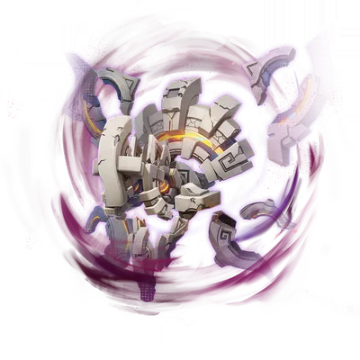
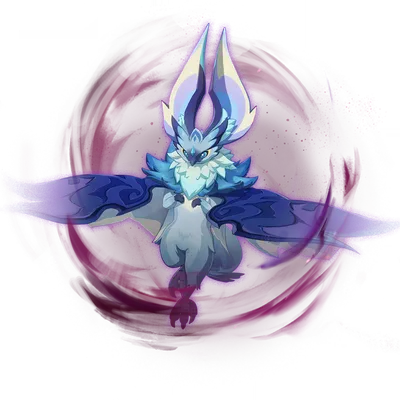
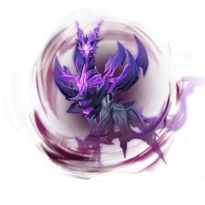
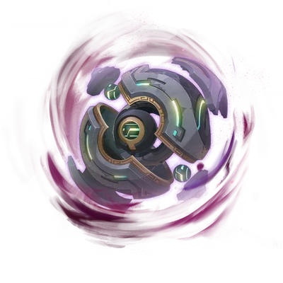
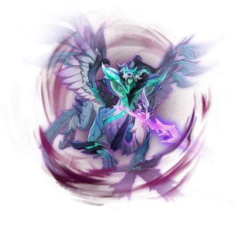

## 5.7

| 水形幻人·极旋湍流 |
| :---------------: |
| N5 / N6：765,8830 / 1726,0004 |

> 入战后，以及后续每 $30s$，会召唤 $2$ 个`半幻人`：具有 $12\%$ 血量和 $12U$ **水盾**（=水深渊法师），但被**冻结**会直接死亡
> 若成功吸收`半幻人`，则进入 $15s$~$25s$ 的狂暴：全抗提升 $+200\%$，并恢复 $12.5\%$ N5 / N6
> 非狂暴时，会蓄力终结技：获得 $8.85\%$ N5 / N6的护盾，清空我方全部角色的 E Q 冷却，恢复全部元素能量和战意
> 蓄力完成时，若未能破除护盾，则直接消灭场上所有角色

> > **双重半幻人**
> > 受到地脉紊乱的影响，挑战中，间歇性出现「`半幻人`」将增加至 $2$ 位。一段时间后，水形幻人将吸收`半幻人`以强化自身：恢复大量N5 / N6、体型变大、攻击力提升，且将发动更具威胁的攻击。及时通过攻击或元素反应消灭「`半幻人`」或将其**冻结**可以中断吸收的进程
>
> > **洪流环击**
> > 受到地脉紊乱的影响，挑战中，水形幻人将展开护盾，进入蓄能态势，准备释放「洪流环击」。如果「洪流环击」成功释放，将使我方当前场上的角色直接倒下。水形幻人展开护盾时，队伍中所有角色的元素战技和元素爆发冷却时间将重置，且将恢复元素能量、战意或蛇之狡谋。在水形幻人蓄能完成前破除护盾，即可打断「洪流环击」的释放

> 由水凝聚成的初具人形的魔物。
> 曾有无数的意志消融在水中，但水中原本就与宇宙一样充满了渴求被诞下的灵魂。
> 在地脉极端紊乱的投映下，深浸于水下的苦痛与怨恨，以某种扭曲的形式交织于原本的人形之上，要将可悲的消逝再度重演…

---

| 熔岩辉龙像·炽烈流焰 |
| :-----------------: |
| N5 / N6：569,0636 / 1118,3933 |

> 初始处于「岩之人」状态：全抗 $200\%$，受到**火元素**攻击 $+2\%$ 进度，每被施加 $1U$ **火附着**额外 $+3.2\%$
> 进度填满后进化为「熔焰之龙」：自挂**火**，**火抗** $200\%$，其他抗 $45\%$，受到**火元素**攻击 $+1\%$ 进度，每被施加 $1U$ **火附着**额外 $+1.6\%$，受到**冰**/**水**伤害 $-22\%$
> 进度再次填满后瘫痪：全抗 $10\%$，持续 $17s$，恢复后回到「岩之人」状态

> > **炽岩双身**
> > 初始处于「岩之人」状态，具备较高的所有元素与`物理`抗性，受到一定次数的**火元素**伤害后，将完全进入「熔焰之龙」的状态，**火元素**外的所有元素与`物理`抗性大幅降低；继续受到**火元素**伤害后，将阶段性承受额外伤害，在「熔焰之龙」状态下受到一定次数的**火元素**伤害后，将过度**燃烧**，倒下瘫痪，所有元素与`物理`抗性进一步降低。瘫痪一段时间后，将恢复回「岩之人」状态
>
> > **冷缩效果**
> > 受到**水元素**伤害或**冰元素**伤害后，将逐渐恢复回抗性较高的「岩之人」状态
>
> > **滚热固化**
> > 受到地脉紊乱的影响，强敌的所有抗性进一步提升。并且致使其转换形态所需的**火元素**伤害次数增加

> 能够自身持续产生热量，以维持活动状态的魔物。
> 无法从纯粹的能量中诞生智慧，无知无觉，而徒具伟大种族形廓的失败品。
> 即使曾与死物无异，紊乱地脉中至为暴戾的奔流，也将亡者的「憎恨」教给了它，在它出于本能的战斗中嵌入了至危的邪念…

---

| 秘源机兵统御械·毁灭武装 |
| :---------------------: |
| N5 / N6：760,6009 / 1491,6723 |

> 入战后立刻进入强化状态：全抗 $270\%$，并逐渐积累能量施放旋转攻击，能量越高伤害越高
> 强化期间，若维持**冰元素**伤害频率高于每 $0.6s$ 一次，则可使其陷入低能量状态：**冰抗**变为 $-30\%$，其他抗 $30\%$，首次进入时产生等同于 $36$ 能量的`元素微粒`
> 强化期间，若侦测到处于`夜魂`加持状态的角色，将进入特殊状态：全抗 $110\%$，改为使用极为强力的追踪射线进行攻击

> > **【先制荡除模式】**
> > 战斗开始后将立即进入「荡除模式」：所有元素与`物理`抗性大幅提升，并会一边产生「`液流动量`」一边进行攻击，「`液流动量`」越高，旋转速度与造成的伤害越高。受到**冰元素**伤害后，将损失「`液流动量`」，「`液流动量`」低于一定值时，将停止旋转攻击，且所有元素与`物理`抗性大幅降低，且**冰元素**抗性额外降低。每次进入「荡除模式」后首次停止旋转攻击时，将产生额外的`元素晶球`
>
> > **【强载应战状态】**
> > 若场上角色进入并维持「`夜魂`加持」状态一段时间，此敌人将进入「强载应战状态」，改为使用强力的追踪射线进行攻击，此时其所有元素与`物理`抗性降低。此状态下，受到一定次数的**冰元素**伤害后，将停止攻击，且所有元素与`物理`抗性进一步降低
>
> > **【抗损结构】**
> > 受到地脉紊乱的影响，强敌的所有抗性进一步提高，并且受到**冰元素**伤害时损失的「`液流动量`」更少。处于「强载应战状态」时，自身的抗性下降程度较低

> 深古遗迹的统御用机关。
> 曾经，一度伟大的古老种族借由这种机关来统御城市的运转，即使在旧日文明崩毁的现在，也依然拥有着极高的权能。
> 在地脉乱象的深处，曾因时间流逝而磨损的核心能量重归充盈，甚至达到万分危险的「过载」级别。这一机关足以挣脱星球束缚的恐怖功率，最终以超出设计规格的水准完全释放，驱动起它那可怖的「毁灭武装」…

---

## 5.8

| 深邃摹结株·虚暗幻变 |
| :-----------------: |
| N5 / N6：641,9728 / 1116,8065 |

> 非瘫痪期间永远具有`虚界力护罩`：受到 $150$ 次元素伤害才能破除，`夜魂`伤害视为 $3$ 次伤害
> 破除`虚界力护罩`使其瘫痪并损失生命值，等同于`虚界力护罩`受到的 $10\%$ 非`夜魂`伤害 + $60\%$ `夜魂`伤害，不超过 $30\%$ 生命值
> 若一段时间内未能破除`虚界力护罩`，将施放终结技使当前场上角色直接倒下

> > **深邃拟态**
> > 能够扭曲自己的姿态，变化成强大的敌人进行攻击
>
> > **蚀破攻击**
> > 部分攻击会施加可叠加的「蚀破」状态，会在一定时间后，使队伍中自己的当前场上角色损失生命值
>
> > **虚暗加护**
> > 受到地脉紊乱的影响，深邃摹结株会一边展开`虚界力护罩`，一边进行战斗。通过一定次数的元素攻击可以破坏`虚界力护罩`；护罩被破坏后，深邃摹结株会依据`虚界力护罩`所抵挡的伤害值受到一次高额伤害，并陷入较长时间的虚弱。具有`夜魂`性质的元素攻击会有更高的破坏效率，并且使护罩破坏时受到的伤害提高。陷入虚弱状态一段时间后，深邃摹结株会尝试重新展开`虚界力护罩`
>
> > **憎戾晦暗祝祷**
> > 受到地脉紊乱的影响，如果`虚界力护罩`长时间未被破坏，深邃摹结株会进行「憎戾晦暗祝祷」：进入蓄能态势，如果一段时间后`虚界力护罩`仍未被破坏，则会释放「憎戾晦暗轰击」，使我方当前场上的角色直接倒下

> 如植株般侵蚀生长的深渊魔物。
> 持续侵蚀此界的扭曲者，能够提取大地之中相对深层的记忆，亦能通过深渊的力量复现更为强大的记忆体。在地脉极端紊乱的投映下，曾随此物之根须散播的憎恶，逐渐转变为凶锐的锋刃，要让来访的挑战者们体会至为深刻的痛苦…

---

| 历经百战的玳龟·坚盾轰霆 |
| :---------------------: |
| N5 / N6：635,0004 / 1328,3708 |

> 每次受到攻击进度 $+3$，每秒进度 $-4$
> 进度达到 $30$ 时，开启 $32U$ **雷元素**护盾，此时每次受到攻击都会触发反击，造成大量伤害

> > **雷棘护罩**
> > 受到一定次数的攻击后，会展开「雷棘护罩」：护罩存在期间受到攻击时，会对附近的角色造成反噬伤害；通过元素反应耗尽护罩的**雷元素**，才能破坏护罩
>
> > **久续之霆**
> > 受到地脉紊乱的影响，每次受到攻击时，该敌人展开「雷棘护罩」的进度将以更高的幅度累积，但进度将随着时间流逝缓慢回退；此外，破除「雷棘护罩」所需的元素将显著增加

> 平日里性情温和，行动迟缓的爬行动物，被一些人视为吉祥与智慧的象征。但必要之时，这一特殊的个体也会对挑战者发起迅猛的攻势，将厚实的甲壳化为击碎敌人的重锤。
> 在地脉极端紊乱的投映下，它的形象遭到扭曲，以狂热好战的姿态参战，成为攻守兼备的雷霆…

---

| 历经百战的皮皮潘偶像·百诈瞬变 |
| :---------------------------: |
| N5 / N6：625,4996 / 1020,0306 |

> 会创造三顶帽子，隐藏于其中一顶之下，并快速变换帽子的位置，如果本体帽子受到**感电**或**月感电**伤害，则会暂停
> 帽子具有 $36\%$~$40\%$ 血量，除水雷外的其他抗性大幅提升，受到的**感电**和**月感电**伤害 $+300\%$
> 击败本体帽子使其瘫痪（巨幅降低全部抗性），**感电**和**月感电**伤害的击破效率大幅提升
> 瘫痪时会损失生命值，等同于帽子受到的 $12\%$ 非水雷伤害 + $100\%$ 水雷伤害，不超过帽子生命值的 $120\%$

> > **帽子演绎**
> > 战斗中，会创造多顶帽子，并将本体隐藏于其中一顶帽子下，随后快速变换帽子的位置。变换一定次数后，如果本体所隐藏的帽子受到**感电**或**月感电**伤害，则会使所有帽子位置的变换暂时停止。对本体所隐藏的帽子造成一定伤害即可将所有帽子破坏，从而使本体现身；受到一次高额伤害，并陷入一段时间的虚弱状态；**感电**或**月感电**反应对帽子有着更高的破坏效率。帽子被破坏时本体所受到的伤害，会基于帽子受到**水元素**伤害、**雷元素**伤害、**感电**或**月感电**伤害而提高
>
> > **帽子拒绝**
> > 受到地脉紊乱的影响，该敌人会发动强力的「帽子拒绝」攻击：持续投掷能够造成高额**雷元素**伤害的帽子，且帽子具有强大打断效果

> 以「特诺切」为演绎目标的皮皮潘偶像，精通奇妙的帽子戏法与战斗策略，能从多变的角度攻来，让鲁莽者付出代价…
> 在地脉极端紊乱的投映下，演绎者的偏执具象为拒绝与扼杀的攻势。挑战者稍有不慎，就会如「特诺切」碾碎的对手般化为齑粉…

---

## 6.0

| 兆载永劫龙兽·歼灭构型 |
| :-------------------: |
| N5 / N6：600,4430 / 1390,9262 |

> 生命值降低至$75\%$/$50\%$/$25\%$时，将【锁血】并吸收上一周期受到伤害最高的元素，使对应抗性提升 $200\%$
> 初始处于地面状态，若长时间维持同一种元素抗性，则会切换为空中状态
> 攻击弱点部位不会使其瘫痪，且不会清除元素抗性提升

> > **紧急反制措施**
> > 受到地脉紊乱的影响，每承受一定比例生命值的伤害，就会释放能量洪流，并根据这段时间所受伤害最高的元素类型来切换形态，极大提升对应元素抗性。
>
> > **多重交战机制**
> > 受到地脉紊乱的影响，初始会以地面状态开始战斗。如果长时间未释放能量洪流，就会切换到升空状态进行战斗。
>
> > **核心装甲隔舱**
> > 受到地脉紊乱的影响，身体的诸多核心都被保护了起来，不再会因为核心受到攻击而瘫痪，也不会因此而清除已有的元素抗性。

> 如同古时曾制御大地的君王一般，令人望而生畏的龙形战斗机械。这架不知疲倦的神秘机械巨兽似乎证明，传说已经覆灭的国度确已触及了人所不应抵达的领域。
> 经由地脉乱象的长久侵染，它的框架竟已悄然演进，对歼灭任务产生了卓越的适应逻辑，成为战场上至为致命的噩梦…

---

| 历经百战的岩居蟹·百万爆轰 |
| :-----------------------: |
| N5 / N6：583,3715 / 1005,3990 |

> 在场上散布「`岩居之种`」：短暂间隔后爆炸，若受到**火元素**伤害，则会对角色造成巨额伤害
> 「`岩居之种`」受到任意类型**绽放**伤害后，会被转化：对首领造成$500\%$自身受到的**绽放**伤害的伤害，不超过$150,0000$
> 战斗开始后，敌人立刻升空蓄力，转化$6$个「`岩居之种`」可以破除护盾使其瘫痪，使全部抗性降低$40\%$，否则将直接击败场上角色

> > **岩居之种**
> > 战斗中，将在场上散布「`岩居之种`」：短暂间隔后爆炸；若在爆炸前受到**绽放**、**烈绽放**、**超绽放**或**月绽放**反应伤害，则会被转化，对岩居蟹发动反噬攻击，并根据所受伤害的总值造成对应伤害。易燃寄种受到地脉紊乱的影响，「`岩居之种`」受到**火元素**伤害后将剧烈爆炸，击飞角色并造成极高伤害。
>
> > **伟大君临轰袭**
> > 受到地脉紊乱的影响，战斗开始后，岩居蟹会升空，散布大量「`岩居之种`」后开始蓄力，并在蓄力完成后引爆「`岩居之种`」，造成大范围伤害使我方当前场上的角色直接倒下，并使自身所有抗性在一段时间内大幅提升。蓄力期间，岩居蟹将展开护罩，通过转化一定数量的「`岩居之种`」破坏护罩，即可打断岩居蟹的蓄力并使其瘫痪。

> 寄居在螺与壳之中的蟹类，是枫丹重甲蟹的远亲，原本大多性情温顺，几乎不具备攻击性，但也不乏为了整个族群的领地，挺身而出决死搏杀的案例。此时，原本温顺的底色反倒成为了狂烈躁戾的助燃剂。
> 地脉至为扭曲的虚像中，不敌诸多对手的强大「斗士」岩居蟹反复锤炼着自身的进攻手段，追求着面对百千强敌都屹立不倒的战力，最终取得了卓绝的成效…

---

| 历经百战的火刃突击队员·决死武装 |
| :-----------------------------: |
| N5 / N6：923,2639 / 1719,5518 |

> 会展开$3$层$4.5\%$ 生命上限的【护罩】，受到的**感电**伤害$+600\%$，**月感电**伤害$+200\%$
> 护罩额外使除**雷元素**外的所有抗性提升 $60\%$，且会高速自我修复，受到**感电**/**月感电**伤害后，修复几乎停止
> 在一定时间内破除护罩，使敌人虚弱：所有抗性降低$50\%$，恢复后**雷元素**抗性降低$60\%$
> 每层护罩被破坏时，损失$6\%$ 生命值，且产生晶球：**雷元素**能量恢复$18$点，其他元素恢复$6$ 点

> > **多重护盾**
> > 战斗中，敌人将准备启动`雷矩套件`，并展开特殊的「`实验型多重护盾`」保护自身，每隔一段时间，护盾会进行一定程度的自我修复。破坏$3$层护盾后，即可阻止`雷矩套件`启动，并使敌人瘫痪。**感电**和**月感电**伤害对护盾具有更高的破坏效率。每层护盾被破坏时，都会使敌人受到一次高额伤害，并产生额外的`元素晶球`。
>
> > **雷矩轰击**
> > `雷矩套件`成功启动时，将造成大范围**雷元素**伤害，并在接下来的一段时间内持续进行**雷元素**攻击。如果成功阻止套件启动，则会使敌人的装备故障，导致敌人的**雷元素**抗性大幅降低。
>
> > **紧急功率增幅**
> > 受到地脉紊乱的影响，「`实验型多重护盾`」会提升**雷元素**以外的所有抗性，且具有更强的自我修复能力，但是在受到**感电**和**月感电**伤害后自我修复的速度会大大降低。`雷矩套件`成功启动后，会大幅提升造成的伤害，并大幅延长攻击的持续时间。

> 隶属于愚人众特辖队的精锐士官，擅长以巨剑与敌人近身相搏。
> 无论是在抵御漆黑灾厄的战斗中，还是在与那些胆敢阻拦女皇理想的无知者们的战斗中，冲在最前线的突击队都是伤亡最高的编制之一，历经百战却遗憾倒下的老兵，却成为了地脉恐惧记忆的一环，深浸于扭曲奔流许久之后，老兵的残像将过去决死一战所用的锋刃转向了前来平息动乱的挑战者...

---

## 6.1

| 霜夜巡天灵主·惊恨憎愤 |
| :-------------------: |
| N5 / N6：799,6108 / 1271,8649 |

> 会进入「`晦隐`」状态：全部抗性提升 $120\%$，受到$50$ 次伤害才能退出，月曜反应伤害视为$6$ 次伤害
> 退出「`晦隐`」状态时，会吸收期间受到伤害最多的元素类型，获得此元素的免疫效果和永久附着，若月曜反应或`物理`伤害为最高，则不会触发此效果

> > **晦隐状态**
> > 战斗中会进入「`晦隐`」状态：所有抗性大幅提升。受到一定次数的伤害后，会退出「`晦隐`」状态，并将自身元素类型转换为「`晦隐`」期间受到伤害量最多的元素类型，获得对应元素伤害免疫效果和元素附
> 着。
> > **明净月曜**
> > 破除「`晦隐`」状态时，月曜反应伤害具有更高的效率。退出「`晦隐`」状态时如果受到了较高的月曜反应伤害，则会转化为无元素状态，不会获得任何元素伤害免疫效果和元素附着。

> 傲然巡行于霜夜的奇异生灵，能自如驱使如今早已被高天之主驯化的古老力量。但在难以名状的地脉侵扰下，它已与尊贵庄严绝缘，转而化为凶狠险绝的捕猎者，向来访者展现出极寒的锋芒...

---

| 历经百战的执灯人·哀恸回响 |
| :-----------------------: |
| N5 / N6：330,7214×2 / 810,9043×2 |

> **冻结**抵抗 $90\%$，且具有大量快速位移技能
> 第二层生命值为`狂猎`：生命值降至$0$后不会死亡，而是进入「`失色哀恸`」状态，并在一段时间后回复至生命上限；角色施放满辉强化的技能后，`狂猎`将直接进入「`失色哀恸`」状态
> `失色哀恸`：基于队伍是否为满辉，受到的伤害将以$90\%$/$65\%$比例削减生命上限，生命上限降至$0$才会死亡
> 场上会出现`狂猎幽魂`；一段时间后，首领将猎杀场上的全部`狂猎幽魂`，并基于猎物的剩余生命值治疗自身

> > **悲哀游荡**
> > 战斗开始时，处于「游荡」状态，将其生命全部削减后，可以令其陷入「`狂猎`」状态。
>
> > **失色哀恸**
> > 「`狂猎`」状态下，即使失去了全部生命值，也会在一定时间后将生命值恢复至上限，只有将其生命值上限全部削减，才能将其压制。将其生命全部削减或施放被`月兆·满辉`强化的技能时，可以令其陷入短暂
> 的「`失色哀恸`」状态。在此状态下对其造成伤害，可以根据伤害的一定比例削减其生命值上限；如果具有`月兆·满辉`，削减比例将提高。
> > **幽徒狂涌**
> > 处于「`狂猎`」状态时，战斗中会间歇性出现`荒野幽徒`。如果未能在一定时间内击败所有`荒野幽徒`，该敌人就会进行收割：造成极高的范围伤害，肃清所有`荒野幽徒`，并根据`荒野幽徒`剩余的生命值上限恢复自
> 身的生命值上限。受到地脉紊乱的影响，`荒野幽徒`的生命值上限更高，且肃清`荒野幽徒`时，该敌人的生命值上限的恢复比例也更高。

> 昔日对抗漆黑灾厄的英勇战士，即使生命之光已然消逝，其不屈的意志仍未消散，永誓猎杀`狂猎`之人时至今日仍继续着他的无尽战斗。受到地脉乱象至为扭曲的干扰后，他的视野之内，所有来访者都与最为凶险的`狂猎`别无二致，需要他倾尽全部力量，不惜一切代价去死斗…

---

| 历经百战的霜役人·涉血芒锋 |
| :-----------------------: |
| N5 / N6：713,5813 / 1396,9549 |

> **冻结**抵抗 $90\%$，抗打断能力全面增强，无法被角色技能打断，且具有大量快速位移技能
> 没有护盾时，施放「猎杀」并生成护盾：等同于 $22.5\%$ 生命值，被破除时损失等量生命值
> 护盾生成时，为全体角色施加 $2,7100$/$2,9028$ `生命之契`，且存在期间每秒额外施加$8130$/$8708$`生命之契`（N5/N6)

> **迅疾猎杀**：
> 战斗中，会消耗一定比例的生命值，进行「猎杀」：命中角色时，该敌人自身恢复一定比例的生命值，并向命中的角色施加`生命之契`，在`生命之契`存在时使其持续受到伤害。对于具有`生命之契`的角色，此攻击造成的伤害提升。
> > **涉血追猎**
> > 受到地脉紊乱的影响，该敌人具有更高的打断能力与抗打断能力。准备进行「猎杀」时，将进入「`涉血追猎`」状态：生成护盾保护自身，护盾存在期间，该敌人将持续向所有角色施加`生命之契`。护盾被破坏后，该敌人会受到大量伤害。

> 愚人众当中精锐的特务。自幼就被选中，在长久的训练与无数次的汰换后，成为阵列中最优秀的士兵，有着出色的身手与不渝的忠诚心。遗憾的是，在凶险至极点的地脉乱象中，役人的理性已被战斗的欲望吞噬，只知重复猎杀的循环，对来访者倾泻纯粹的狂怒...

---

## 6.2

| 深罪浸礼者·肃烈狂音 |
| :-----------------: |
| N5 / N6：521,3725 / 1090,2915 |

> 会依次展开**雷元素**、**火元素**、**水元素**护盾，每次破除时将损失生命值，全部破除后敌人将瘫痪一段时间
> 护盾量：$12U$/$18U$/$18U$(大世界的$150\%$)
> 损失生命值：$50\%$ 护盾受到的伤害，不超过 $12.5\%$ 生命值，不计入护盾自身元素

> > **元素护罩·纷变狂乱**
> > 受到地脉紊乱的影响，战斗开始后，该敌人会依次展开**雷元素**护罩、**火元素**护罩和**水元素**护罩来保护自身，同时根据元素护罩的类型改变自身的攻击方式。通过元素反应破除一种元素护罩后，该敌人将根据护罩抵挡的伤害值受到一次高额伤害，然后切换元素形态并展开对应元素护罩；全部的三种护罩都被破除后，敌人会瘫痪一段时间。

> 因为深渊的力量取得「进化」而获得了多余的肢体的深渊魔物。能够驱役多种元素的力量。
> 在地脉扭曲的追忆中，它们跃升为狂乱的破坏者，以其亵渎的力量掀起接踵而至的灾厄浪潮…

---

| 历经百战的暝视龙·霜雪苛念 |
| :-----------------------: |
| N5 / N6：434,4257 / 797,2064 |

> 所有抗性为 $70\%$，**冰元素**抗性$110\%$
> 会升空并获得**冰元素**护盾，并为我方全体激活元素爆发，地面上出现**冰元素**物件，将其破坏可以额外削减护盾，护盾被破除时损失生命值，并额外受到大量坠落伤害
> 会出现可以被牵引的「扰乱风涡」，命中敌人时降低$35\%$**风元素**抗性并削减$2U$护盾，可叠加$3$层
> 护盾量：$24U$，物件 $8U$，破坏削减$9.6U$ 护盾
> 损失生命值：$10\%$ 生命值+ $50\%$ 护盾受到的伤害，不超过$35\%$ 生命值

> > **强音震波·连奏**
> > 受到地脉紊乱的影响，会具有更高的所有抗性；在战斗中，会更为频繁地腾跃升空，在空中停留一段时间，并不断释放强音震波进行攻击。
>
> > **冰霰骤袭·袤攻**
> > 战斗中，会展开**冰元素**护罩保护自身，并腾跃至空中为「冰霰骤袭」进行准备，一段时间后释放「冰霰骤袭」，使我方场上的角色直接倒下。通过元素反应破除护罩，即可将敌人击落至地面，根据护罩抵挡的伤害值使其受到一次高额伤害，并打断其攻击准备。该敌人准备上述攻击时，我方队伍中所有角色将恢复元素能量、战意或蛇之狡谋。一段时间后如果护罩仍未破除，地面上将出现「冰霰之阵」：通过元
> 素反应逐一破坏「冰霰之阵」，也可以逐渐破除该敌人的**冰元素**护罩。
> > **扰乱风涡**
> > 受到地脉紊乱的影响，该敌人在进行「冰霰骤袭」的准备时，场上将出现「扰乱风涡」，造成不分敌我的**冰元素**范围伤害。「扰乱风涡」命中该敌人时，将使其**风元素**抗性降低，并削减其护罩。此外，「扰乱风涡」可被牵引效果影响，改变移动路径。

> 能够利用生长出的覆羽进行腾跃，亦是唯一—种掌握了进入「灵觉」状态技巧的龙。
> 它观测到一切苦楚和悲痛，尽被地脉的扭曲追忆吞噬，化作极寒的霜雪风暴，带来无尽的混乱...

---

| 实验性场力发生装置·极端势能 |
| :-------------------------: |
| N5 / N6：1323,1421 / 2302,0735 |

> 会展开「`重力削减力场`」使跳跃能力大幅提升，同时在地面展开极为猛烈的，无法闪避的攻势，且每$5s$使自身的威力获得一层大幅强化，受到视为下落攻击的伤害后移除一层
> 角色从低处上升至一定高度时，攻击力提升 $600\%$，持续$1.5s$
> 可以获得增益的行为：蓝砚战技、一般角色跳跃、瓦雷莎/嘉明特殊下落攻击
> 不能获得增益的行为：菲林斯雷霆交响、恰斯卡`夜魂`加持、玛薇卡坠日斩

> > **重力核心·深度过载**
> > 受到地脉紊乱的影响，会在战斗中展开`重力削减力场`，使角色的跳跃高度获得显著提升，并且每次跳跃至一定高度，角色的攻击力都会在$1.5$秒内大幅提升。力场持续期间，每隔一段时间就会在地面上产生无法被闪避的引力冲击波。每经过$5$秒，引力冲击波的威力和频率就会获得$1$层强化；每受到一次下落攻击，就会移除$1$层引力冲击波强化。
>
> > **强韧核心**
> > 受到地脉紊乱的影响，荒性核心变得更加坚固，即使在受到$3$次芒性攻击后，也不再会导致`重力削减力场`关闭。

> 枫丹动能工程科学研究院的作品，拥有「抵消」重力的效果，因为事故而失控。
> 在紊乱地脉的作用下，其核心狂暴异常，释放的重力场能量如海啸般奔涌，仿佛要将大地倾覆...

---

## 6.3

| 深黯魇语之主·袭掠锋刃 |
| :-------------------: |
| N5 / N6：1243,7830 / 2365,8108 |

> 会展开 $45\%$生命值的「`深黯护盾`」，其受到的月曜反应伤害为原伤害的$300\%$，但免疫`物理`伤害，首次受到月曜反应伤害时，产生等同于$36$能量的`元素晶球`
> 护盾破除时，损失$20\%$ 生命值并虚弱一段时间，期间全部抗性变为$-60\%$
> 蓄力终结技时会召唤`深黯钓客`(每个$18\%$生命值)，每击败一个召唤物，护盾损失$25\%$

> > **深黯护盾·沉疴**
> > 受到地脉紊乱的影响，深黯魇语之主会凝聚深渊之力结成极为坚韧的护盾保护自身。使用月曜反应伤害可以更高效地破坏该护盾。强敌在展开护盾后，其护盾首次承受月曜反应伤害时，会产生额外的`元素晶球`。护盾被破坏后，深黯魔语之主将受到一次高额伤害，并陷入一段时间的虚弱状态。
>
> > **裂隙强袭**
> > 受到地脉紊乱的影响，战斗中，深黯魇语之主会进行长时间的蓄力，同时召唤数名`深黯钓客`。蓄力完成后，将造成大范围伤害，并吞噬所有`深黯钓客`。蓄力期间，通过击败`深黯钓客`破坏护盾，即可打断深黯魇语之主的蓄力。

> 伏行于深黯的裂隙，窥伺此世的深渊魔物。据说那怪异、亵渎的无面形貌不过是投射于世界上的影像，其真实姿态乃是以纯粹深渊能量形式存在的无形之物。
> 在地脉乱象狂乱的裹挟中，它疯狂与谵妄的低语被锻成了锐不可当的刀锋，誓要将此世的安稳秩序撕碎...

---

| 历经百战的火刃突击队员·决死武装 |
| :-----------------------------: |
| N5 / N6：923,2639 / 1719,5518 |

> 会展开$3$层$4.5\%$ 生命上限的【护罩】，受到的**感电**伤害$+600\%$，**月感电**伤害$+200\%$
> 护罩额外使除**雷元素**外的所有抗性提升 $60\%$，且会高速自我修复，受到**感电**/**月感电**伤害后，修复几乎停止
> 在一定时间内破除护罩，使敌人虚弱：所有抗性降低$50\%$，恢复后**雷元素**抗性降低$60\%$
> 每层护罩被破坏时，损失$6\%$ 生命值，且产生晶球：**雷元素**能量恢复$18$点，其他元素恢复$6$ 点

> > **多重护盾**
> > 战斗中，敌人将准备启动`雷矩套件`，并展开特殊的「`实验型多重护盾`」保护自身，每隔一段时间，护盾会进行一定程度的自我修复。破坏$3$层护盾后，即可阻止`雷矩套件`启动，并使敌人瘫痪。**感电**和**月感电**伤害对护盾具有更高的破坏效率。每层护盾被破坏时，都会使敌人受到一次高额伤害，并产生额外的`元素晶球`。
>
> > **雷矩轰击**
> > `雷矩套件`成功启动时，将造成大范围**雷元素**伤害，并在接下来的一段时间内持续进行**雷元素**攻击。如果成功阻止套件启动，则会使敌人的装备故障，导致敌人的**雷元素**抗性大幅降低。
>
> > **紧急功率增幅**
> > 受到地脉紊乱的影响，「`实验型多重护盾`」会提升**雷元素**以外的所有抗性，且具有更强的自我修复能力，但是在受到**感电**和**月感电**伤害后自我修复的速度会大大降低。`雷矩套件`成功启动后，会大幅提升造成的伤害，并大幅延长攻击的持续时间。

> 隶属于愚人众特辖队的精锐士官，擅长以巨剑与敌人近身相搏。
> 无论是在抵御漆黑灾厄的战斗中，还是在与那些胆敢阻拦女皇理想的无知者们的战斗中，冲在最前线的突击队都是伤亡最高的编制之一，历经百战却遗憾倒下的老兵，却成为了地脉恐惧记忆的一环，深浸于扭曲奔流许久之后，老兵的残像将过去决死一战所用的锋刃转向了前来平息动乱的挑战者...

---

| 铁甲熔火帝皇·敕命远征 |
| :-------------------: |
| N5 / N6：855,2749 / 1404,2886 |

> 具有 $64U$ **火元素**器官「熔火双角」，使全部抗性提升$150\%$，破坏后损失$10\%$ 生命值
> 会召唤「坚盾重甲蟹」，其具有 $12U$ **火元素**，**火元素**被耗尽时将失控撞向首领，使其损失$12U$ **火元素**
> 首领被撞时还会基于「坚盾重甲蟹」受到的伤害损失生命值，等同于其受到的$60\%$ **水元素**伤害$+10\%$ 非**水元素**伤害，不超过首领 $15\%$ 生命值

> > **熔火角冠**
> > 铁甲熔火帝皇身躯上方高处的熔火双角是**火元素**的身体器官，使其能够进行更猛烈的元素攻击，并且拥有更强的防御能力。在进行部分攻击时，熔火双角会贴近地面，此时是利用元素反应摧毁双角的较好时
> 机。当熔火双角的**火元素**耗尽后，双角会被破坏，强敌将受到一次高额伤害；熔火双角需经过一段时间才能恢复。
> > **持盾扈从**
> > 受到地脉紊乱的影响，铁甲熔火帝皇在进行部分攻击时会召唤「坚盾重甲蟹」助战。「坚盾重甲蟹」会持续为熔火双角补充**火元素**，但当其自身的**火元素**被耗尽后将被击败。被击败的「坚盾重甲蟹」会失控
> 撞向铁甲熔火帝皇，使其熔火双角的**火元素**因过载而受损，并根据「坚盾重甲蟹」所受伤害的总值对铁甲熔火帝皇造成一定比例伤害。场上最多同时存在三只「坚盾重甲蟹」。
> > **璀璨加冕**
> > 受到地脉紊乱的影响，铁甲熔火帝皇会在战斗中进行「璀璨加冕」：进行一段时间的蓄能，完成后将造成大范围伤害。破坏熔火双角，即可打断铁甲熔火帝皇的蓄能。

> 矗立在原海异种顶端的两位霸主之一，曾经是海员之间的逸闻。不遇天敌，能够一直狩猎、进食的重甲蟹会随着成长，不断寻找适合的螺与贝壳，作为新的甲胄。
> 经由地脉乱象的扭曲演绎，它凶横的身姿已化作小型军队，对目之所及的事物大张挞伐，仿若一场会移动的蟹形凶灾…

---

## 6.4

| 历经百战的十六倍曼陀草·风滚狂蔓 |
| :-----------------------------: |
| N5 / N6：645,9516 / 1189,6648 |

> 初始处于活化聚合态，具有$300\%$的额外抗性，活化能量条自然衰减需要$38s$，受到**雷元素**或**火元素**伤害时，活化能量条衰减加速$0.2s$，若本次伤害具有元素附着，则额外加速$1s$
> 聚合状态结束时会进入分裂态，分裂为$10$个散开的孢子，每个孢子具有本体最大生命值的$10\%$，分裂态持续$22s$，且聚合时强敌会基于孢子受到伤害总值的一定比例受到一次高额伤害
> 若在分裂期间至少消灭了$8$个孢子，则重新聚合时，强敌会进入脆性聚合：失去额外抗性。若提前消灭了全部孢子，那么强敌会提前聚合。且强敌处于分裂态和脆性聚合期间：**风元素**抗性为$-40\%$

> > **强效聚合状态**
> > 受到地脉紊乱的影响，战斗开始时，强敌将进入「聚合状态」：所有抗性极大幅提升。该状态会不断消耗强敌的「聚合能量」，使用**火元素**或**雷元素**对强敌造成伤害，也会加速能量的消耗。当「聚合能量」耗尽后，强敌将释放「滋蔓之茵」，并转变为「分裂状态」。
>
> > **分裂状态**
> > 强敌进入「分裂状态」时，将分裂为大量孢子。孢子受到伤害时，会根据其所受伤害总值对强敌造成一定比例的伤害。「分裂状态」持续一段时间后，强敌将回到「聚合状态」。此情况下，一旦前场上的孢子少于一定数量，强敌将会进入「脆性聚合状态」：所有抗性大幅降低，且战斗能力将被削弱。另外，若「分裂状态」产生出的所有孢子均被击败，则强敌提前退出「分裂状态」并转变为「脆性聚合状态」。
>
> > **空洞结构**
> > 受到地脉紊乱的影响，强敌处于「分裂状态」或「脆性聚合状态」时，**风元素**抗性大幅降低。

> 异乎寻常的巨大曼陀草，似乎是经历了漫长的人工选育才诞生的奇异品种。虽然最初培育它的目的早已不得而知，但从其拥有着独特的领地意识来看，或许它曾是某个特殊实验的产物。
> 受地脉错乱奔流的干扰，其原本蓬勃的生命力被大幅透支，化为制造绿色孢子灾祸的源头。

---

| 重拳出击鸭·重甲武库 |
| :-----------------: |
| N5 / N6：1311,4773 / 2592,5712 |

> `冲鸭机关`存在期间，自身全部抗性$+210\%$，每个`冲鸭机关`具有强敌$25\%$最大生命值，全抗$10\%$
> `冲鸭机关`无法被聚集，也不会被击飞。受到**感电**/**月感电**伤害$+150\%$(增伤区)。对单个`冲鸭机关`造成$20$次**感电**或**月感电**伤害可将其直接击败
> 每个`冲鸭机关`被击破时，其受到的伤害的$20\%$会转化为对首领的伤害，每只`冲鸭机关`记录的伤害不会超过其最大生命值的$20\%$，全部击破后首领护罩消失，进入$12s$瘫痪。瘫痪期间首领全部抗性为$-50\%$
> 瘫痪结束后，首领全抗为$10\%$，**雷元素**抗性保持$-50\%$。约$45s$后首领重新展开护罩

> > **「全装甲歼灭鸭」**
> > 受到地脉紊乱的影响，战斗开始后，强敌会进入「全装甲歼灭鸭」模式，进攻欲望上升，并为自身生成护罩提升所有抗性，还会召唤浮游的`冲鸭机关`进行骚扰。
>
> > **低阻冲鸭机关**
> > 通过多次造成**感电**或**月感电**伤害，或直接对`冲鸭机关`造成足量伤害，可干扰它们的运行。被干扰的`冲鸭机关`会失控撞向重拳出击鸭，并对重拳出击鸭的护罩造成一定伤害。通过这种方式破坏强敌的护罩，即可使强敌退出「全装甲歼灭鸭」模式，因过载而陷入瘫痪，同时使强敌的**雷元素**抗性在一段时间内大幅降低。
>
> > **快速跳频系统**
> > 受到地脉紊乱的影响，`冲鸭机关`变得更加坚固：需要造成更多次**感电**或**月感电**伤害，或造成更高伤害才能干扰其运行。**感电**或**月感电**伤害对`冲鸭机关`具有更高的破坏效率。当失控的`冲鸭机关`撞向重拳出击鸭时，其造成的伤害将根据`冲鸭机关`所受伤害的总值提升。

> 由废弃的金属与机关轴承拼接而成的、造型奇特的月矩力机关，似乎是因为制造者的偏好而被部分赋予了「鸭子」的外观特征。即便是与愚人众最尖端的战争兵器相比，在出力与抗打击性能方面都毫不逊色，但依然只是一只会对敌人重拳出击的玩具鸭子。
> 在地脉极端紊乱的改造下，该机关的投影已然化为了一座满载武备与装甲的机动工厂。稍有不慎，蜂拥而至的`冲鸭机关`便会如同海啸般将挑战者淹没..

---

| 秘源机兵统御械·毁灭武装 |
| :---------------------: |
| N5 / N6：760,6010 / 1474,3273 |

> 入战后立刻进入强化状态：全抗 $270\%$，并逐渐积累能量施放旋转攻击，能量越高伤害越高
> 强化期间，若维持**冰元素**伤害频率高于每 $0.6s$ 一次，则可使其陷入低能量状态：**冰抗**变为 $-30\%$，其他抗 $30\%$，首次进入时产生等同于 $36$ 能量的`元素微粒`
> 强化期间，若侦测到处于`夜魂`加持状态的角色，将进入特殊状态：全抗 $110\%$，改为使用极为强力的追踪射线进行攻击

> > **【先制荡除模式】**
> > 战斗开始后将立即进入「荡除模式」：所有元素与`物理`抗性大幅提升，并会一边产生「`液流动量`」一边进行攻击，「`液流动量`」越高，旋转速度与造成的伤害越高。受到**冰元素**伤害后，将损失「`液流动量`」，「`液流动量`」低于一定值时，将停止旋转攻击，且所有元素与`物理`抗性大幅降低，且**冰元素**抗性额外降低。每次进入「荡除模式」后首次停止旋转攻击时，将产生额外的`元素晶球`
>
> > **【强载应战状态】**
> > 若场上角色进入并维持「`夜魂`加持」状态一段时间，此敌人将进入「强载应战状态」，改为使用强力的追踪射线进行攻击，此时其所有元素与`物理`抗性降低。此状态下，受到一定次数的**冰元素**伤害后，将停止攻击，且所有元素与`物理`抗性进一步降低
>
> > **【抗损结构】**
> > 受到地脉紊乱的影响，强敌的所有抗性进一步提高，并且受到**冰元素**伤害时损失的「`液流动量`」更少。处于「强载应战状态」时，自身的抗性下降程度较低

> 深古遗迹的统御用机关。
> 曾经，一度伟大的古老种族借由这种机关来统御城市的运转，即使在旧日文明崩毁的现在，也依然拥有着极高的权能。
> 在地脉乱象的深处，曾因时间流逝而磨损的核心能量重归充盈，甚至达到万分危险的「过载」级别。这一机关足以挣脱星球束缚的恐怖功率，最终以超出设计规格的水准完全释放，驱动起它那可怖的「毁灭武装」…

---

## 6.5

| 蕴光月守宫·根牙磐错 |
| :-----------------: |
| N5 / N6：1025,3198 / 2095,0071 |

> 入战$2s$后，会展开$9$层**岩盾**，每层$4U$**岩元素**，全部护盾被击破后，首领会基于破盾期间受到**岩元素**伤害的$70\%$与其他伤害的$10\%$受到一次高额伤害(不超过首领最大生命值的$40\%$)，并瘫痪$6s$
> 瘫痪结束的$4s$后，首领会为我方全体施加「蕴光之茧」：立即使角色损失最大生命值的$10\%$$+1800$，角色不会因此而倒下，受到影响的角色造成的伤害$-50\%$，受到的治疗$-40\%$，暴击率$-100\%$（当前场上角色可以通过无敌帧闪避，但后台依然会被挂上)，同时，使首领的**岩元素**抗性提升$60\%$
> 为任意一个友方角色恢复全部生命值即可使首领的**岩元素**抗性回到$10\%$，同时，从「蕴光之茧」中恢复的角色会受到持续$15s$的增益：角色造成的伤害提升$50\%$，暴击率提升$15\%$
> 破除**岩元素**护盾的约$55s$后，首领会重新展开护盾。若未能在$35s$内击破护盾，首领会对全场造成一次高额的伤害并在一段时间内使自身全抗提升

> > **无依的虚荡**
> > 战斗开始后，强敌会在原地留下「`月锚岩`」，然后跳至高处准备施展「无依的虚荡」：一段时间后，释放强力的大范围攻击。可以利用对付**岩元素**的方法来破坏「`月锚岩`」的多层**岩元素**护罩，以将其摧毁。摧毁「`月锚岩`」即可终止该技能的准备，并对强敌造成大量伤害。准备期间「`月锚岩`」受到的伤害越高，「`月锚岩`」被摧毁时强敌受到的伤害也越高。受地脉紊乱影响，使用**岩元素**攻击「`月锚岩`」将进一步增加强敌受到的伤害。
>
> > **难撼的础石**
> > 受到地脉紊乱的影响，「`月锚岩`」的多层**岩元素**护罩会变得更加坚固
>
> > **蕴光之茧**
> > 战斗中，强敌将驱使**岩元素**力，对角色施加「蕴光之茧」，并提升自身的**岩元素**抗性。被「蕴光之茧」束缚的角色，造成的伤害以及受到治疗的效果都会降低，通过治疗使角色的生命值达到上限时，该角色即可从「蕴光之茧」中破茧而出，并获得「出缠」效果，短时间内能力将得到提升，当队伍中任意角色成功破茧后，强敌将失去「蕴光之茧」带来的**岩元素**抗性提升。

> 眷恋月光的古老魔物，在岩层深处栖息的守宫。躯体因长久以来积蓄的月矩力而发生晶化，形成如同机关构件般精密的节段，能化作岩刺攻击敌人。
> 受地脉极端紊乱的影响，其因月矩力催化生成的节段肆意生长，彼此交缠盘结，如巨网般试图将整座山峦侵吞殆尽。

---

| 深邃摹结株·虚暗幻变 |
| :-----------------: |
| N5 / N6：641,9728 / 1116,8065 |

> 非瘫痪期间永远具有`虚界力护罩`：受到 $150$ 次元素伤害才能破除，`夜魂`伤害视为 $3$ 次伤害
> 破除`虚界力护罩`使其瘫痪并损失生命值，等同于`虚界力护罩`受到的 $10\%$ 非`夜魂`伤害 + $60\%$ `夜魂`伤害，不超过 $30\%$ 生命值
> 若一段时间内未能破除`虚界力护罩`，将施放终结技使当前场上角色直接倒下

> > **深邃拟态**
> > 能够扭曲自己的姿态，变化成强大的敌人进行攻击
>
> > **蚀破攻击**
> > 部分攻击会施加可叠加的「蚀破」状态，会在一定时间后，使队伍中自己的当前场上角色损失生命值
>
> > **虚暗加护**
> > 受到地脉紊乱的影响，深邃摹结株会一边展开`虚界力护罩`，一边进行战斗。通过一定次数的元素攻击可以破坏`虚界力护罩`；护罩被破坏后，深邃摹结株会依据`虚界力护罩`所抵挡的伤害值受到一次高额伤害，并陷入较长时间的虚弱。具有`夜魂`性质的元素攻击会有更高的破坏效率，并且使护罩破坏时受到的伤害提高。陷入虚弱状态一段时间后，深邃摹结株会尝试重新展开`虚界力护罩`
>
> > **憎戾晦暗祝祷**
> > 受到地脉紊乱的影响，如果`虚界力护罩`长时间未被破坏，深邃摹结株会进行「憎戾晦暗祝祷」：进入蓄能态势，如果一段时间后`虚界力护罩`仍未被破坏，则会释放「憎戾晦暗轰击」，使我方当前场上的角色直接倒下

> 如植株般侵蚀生长的深渊魔物。
> 持续侵蚀此界的扭曲者，能够提取大地之中相对深层的记忆，亦能通过深渊的力量复现更为强大的记忆体。在地脉极端紊乱的投映下，曾随此物之根须散播的憎恶，逐渐转变为凶锐的锋刃，要让来访的挑战者们体会至为深刻的痛苦…

---

| 霜夜巡天灵主·惊恨憎愤 |
| :-------------------: |
| N5 / N6：749,6352 / 1285,5408 |

> 会进入「`晦隐`」状态：全部抗性提升 $120\%$，受到$50$ 次伤害才能退出，月曜反应伤害视为$6$ 次伤害
> 退出「`晦隐`」状态时，会吸收期间受到伤害最多的元素类型，获得此元素的免疫效果和永久附着，若月曜反应或`物理`伤害为最高，则不会触发此效果

> > **晦隐状态**
> > 战斗中会进入「`晦隐`」状态：所有抗性大幅提升。受到一定次数的伤害后，会退出「`晦隐`」状态，并将自身元素类型转换为「`晦隐`」期间受到伤害量最多的元素类型，获得对应元素伤害免疫效果和元素附着。
>
> > **明净月曜**
> > 破除「`晦隐`」状态时，月曜反应伤害具有更高的效率。退出「`晦隐`」状态时如果受到了较高的月曜反应伤害，则会转化为无元素状态，不会获得任何元素伤害免疫效果和元素附着。

> 傲然巡行于霜夜的奇异生灵，能自如驱使如今早已被高天之主驯化的古老力量。但在难以名状的地脉侵扰下，它已与尊贵庄严绝缘，转而化为凶狠险绝的捕猎者，向来访者展现出极寒的锋芒…

---

## 6.6

| 历经百战的凛狼·极寒冰魄 |
| :---------------------: |
| N5 / N6：999,6869 / 2020,1855 |

> 「先祖狼魂」 $24U$ **冰盾**
> 「先祖狼魂」被击败后，强敌损失「先祖狼魂」所受到的$60\%$**火元素**伤害和**风元素**伤害，$10\%$其他伤害，不超过强敌最大生命值的$40\%$，破盾后强敌全抗降低 $70\%$

> > **先祖狼魂·降灵**
> > 战斗开始时，强敌会召唤「先祖狼魂」与自身协同作战。受到地脉紊乱的影响，强敌受「先祖狼魂」护佑时，将不会承受伤害。作为灵体的「先祖狼魂」具有特殊的**冰元素**护罩，只有通过**火元素****扩散**反应或**雷元素****扩散**反应才能将其破除。护罩被破除后，「先祖狼魂」将会消散，强敌也将随之陷入短暂的瘫痪状态，并受到大量反噬伤害。护罩存在期间，强敌受到的伤害越高，反噬伤害也越高；其中，**火元素**伤害和**风元素**伤害将进一步提高反噬伤害。

> 与当地狼群格格不入的孤狼，碧色的鬃毛昭示着它的血统来自遥远的异乡。在地脉能量狂乱的激荡中，先祖的记忆已然扭曲为可怕的诅咒。极寒的恨意浸透了它的身躯，正无情地驱动着这头野兽，去撕碎其所能看到的一切。

---

| 水形幻人·极漩涌流 |
| :---------------: |
| N5 / N6：765,8830 / 1726,0004 |

> 入战后，以及后续每$30s$，会召唤$2$ 个`半幻人`：具有$12\%$血量和$12U$**水盾**(=水深渊法师)，但被**冻结**会直接死亡
> 若成功吸收`半幻人`，则进入$15s$~$25s$的狂暴：全抗提升$+200\%$，并恢复$12.5\%$ 生命值
> 非狂暴时，会蓄力终结技：获得$8.85\%$生命值的护盾，清空我方全部角色的E Q冷却，恢复全部元素能量和战意
> 蓄力完成时，若未能破除护盾，则直接消灭场上所有角色

> > **双重半幻人**
> > 受到地脉紊乱的影响，挑战中，间歇性出现「`半幻人`」将增加至$2$位。一段时间后，水形幻人将吸收`半幻人`以强化自身：恢复大量生命值、体型变大，攻击力提升，且将发动更具威胁的攻击。
> 及时通过攻击或元素反应消灭「`半幻人`」或将其**冻结**可以中断吸收的进程。
> > **洪流环击**
> > 受到地脉紊乱的影响，挑战中，水形幻人将展开护盾，进入蓄能态势，准备释放「洪流环击」。如果「洪流环击」成功释放，将使我方当前场上的角色直接倒下。水形幻人展开护盾时，队伍中所有角色的元素战技和元素爆发冷却时间将重置，且将恢复元素能量、战意或蛇之狡谋。在水形幻人蓄能完成前破除护盾，即可打断「洪流环击」的释放。

> 由水凝聚成的初具人形的魔物。
> 曾有无数的意志消融在水中，但水中原本就与宇宙一样充满了渴求被诞下的灵魂。在地脉极端紊乱的投映下，深浸于水下的苦痛与怨恨，以某种扭曲的形式交织于原本的人形之上，要将可悲的消逝再度重演..

---

| 开眼者·傲然睥睨 |
| :-------------: |
| N5 / N6：1358,6195 / 2853,7363 |

> `惰性元素星` $140\%$ 全抗
> 记录期间，开眼者的所有元素抗性与`物理`抗性提升至$80\%$。记录需要造成$5$次伤害，相同元素被再次记录需要$15$次
> 同元素的两颗元素星HP为强敌的$16.67\%$，异元素的两颗则为强敌的 $6.67\%$，击破一颗会使强敌损失$6\%$ 生命值，第二颗会损失$18\%$生命值

> > **「监候之统摄」**
> > 战斗开始时，开眼者会进入「监候之统摄」状态。在该状态下，并分别记录受到的**火**/**水**/**雷**/**冰**元素伤害的次数，当某一元素的伤害次数达到$5$次时，便会退出该状态，并记录该元素为监控目标。若未能成功监控任何元素，则记录为空，并造成一次**岩元素**伤害。首次「监候之统摄」结束后，强敌将在一定间隔后再次进入该状态。受到地脉紊乱的影响，第二次记录的时间会变长，对于已被监控的元素，需要累计极多次伤
> 害方可被再次监控。受到地脉紊乱的影响，「监候之统摄」期间，开眼者的所有元素抗性与`物理`抗性提升。
> > **「现象之谵妄」**
> > 在完成两次元素监控后，开眼者将飞临空中，准备施展「现象之谵妄」，释放此前监控到的元素类型，并召唤两颗对应元素的「`活性元素星`」。若元素记录为空，则会召唤具有较高的所有元素抗性与`物理`抗性的「`惰性元素星`」。如果强敌召唤了两颗不同元素的「`活性元素星`」，则两颗元素星将变得更易被破坏。当「`活性元素星`」被摧毀时，将对强敌造成一次其所记录元素的高额伤害。若被摧毁的为「`惰性元素星`」，则将对强敌造成**岩元素**伤害。击破全部元素星，即可终止「现象之谵妄」的准备。若未能在限定时间内摧毁两颗元素星，它们将引发爆炸，造成高额大范围伤害。

> 原初的大能者流溢而出的影之造物，曾居于高天之上的守望者，终因开眼而堕入尘世。
> 在地脉狂暴且错谬的信息洪流轰炸下，其傲慢的本质异化为纯粹的破坏欲，驱使它将目光所及的一切尽数湮灭。

---

## 6.7

| 先驱秘源统辖阵列之影·蜂巢意志 |
| :---------------------------: |
| N5 / N6：826,8034 / 1674,3001 |

> 战斗开始时，强敌会张开自身最大生命值$100\%$的力场能量护盾，开启护盾$5s$后，强敌会将除**冰元素**和**雷元素**以外的全元素抗性提升至$135\%$，并进行持续$45s$的蓄力。**超导**和**星超导**伤害对护盾造成的伤害提升$150\%$，且护盾每次受到**超导**或**星超导**伤害时会被额外削减$4\%$。此外，击破每个`探侦机关`也可以削减$12.5\%$护盾，护盾被破除后，将对强敌造成持有护盾期间受到$100\%$的反噬伤害，最多不超过本体最大生命值的$40\%$。随后强敌陷入$13s$的瘫痪，期间全抗降低至$-40\%$，$25$-$35s$后再次开盾
> 每个`探侦机关`具有$12U$**水元素**护盾，位于场地边缘，高度3m。受到**超导**/**星超导**/`碎冰`/`融化`伤害时，将被直接摧毁，强敌收回`探侦机关`时，会根据回收的机关数量获得$12$+$6$*回收数量的**水元素**护盾
> 在战斗中，力场能量护盾存在期间，会创造低重力环境，极大减缓角色跳跃动作速度，同时强敌会多次使用快速移动技能，躲避近战攻击

> > **镇压力场•能量循环**
> > 战斗开始时，强敌会部署$4$架受**水元素**护罩保护的`探侦机关`，构建特殊的镇压力场。该力场将为强敌生成力场能量护盾，并提高强敌**冰元素**与**雷元素**外的所有抗性。力场维持一段时间后，强敌将发动「阿尔法突袭」：造成大范围伤害，同时收回所有`探侦机关`，并根据回收数量，获得相应吸收量的**水元素**护罩。若未能回收任何`探侦机关`，则仅获得少量**水元素**护罩。
>
> > **力场能量护盾**
> > 受地脉紊乱影响，强敌的力场能量护盾被破除时，镇压力场将随之瓦解，强敌自身也将受到一次高额反噬伤害，并陷入短暂的瘫痪状态。此外，强敌每次受到**超导**、**星超导**反应影响时，均会削减固定量的护盾。而**超导**、**星超导**反应伤害不仅对护盾具有更高的破坏效率，还将进一步提高护盾被破除时强敌受到的反噬伤害。
>
> > **探侦机关·冲压构件**
> > `探侦机关`在**水元素**护罩被破除或陷入**冻结**状态后受到`碎冰`或`融化`等元素反应伤害时将被摧毁。受地脉紊乱影响，每当一架`探侦机关`被摧毁时，都会使强敌的护罩受损。

> 原本只是为了辅助进行月球研究的工作而研发出的协作机关，却在日后被赋予了远超其设计初衷的威能与重任。
> 在地脉乱象长久的扭曲与侵蚀下，其核心与`探侦机关`已被彻底覆写。昔日的设计初衷荡然无存，如今驱动它的，唯有命令无尽机群淹没一切生灵的毁灭意志。

---

| 深黯魇语之主·袭掠锋刃 |
| :-------------------: |
| N5 / N6：1243,7830 / 2365,8108 |

> 会展开 $45\%$生命值的「`深黯护盾`」，其受到的月曜反应伤害为原伤害的$300\%$，但免疫`物理`伤害，首次受到月曜反应伤害时，产生等同于$36$能量的`元素晶球`
> 护盾破除时，损失$20\%$ 生命值并虚弱一段时间，期间全部抗性变为$-60\%$
> 蓄力终结技时会召唤`深黯钓客`(每个$18\%$生命值)，每击败一个召唤物，护盾损失$25\%$

> > **深黯护盾·沉疴**
> > 受到地脉紊乱的影响，深黯魇语之主会凝聚深渊之力结成极为坚韧的护盾保护自身。使用月曜反应伤害可以更高效地破坏该护盾。强敌在展开护盾后，其护盾首次承受月曜反应伤害时，会产生额外的`元素晶球`。护盾被破坏后，深黯魔语之主将受到一次高额伤害，并陷入一段时间的虚弱状态。
>
> > **裂隙强袭**
> > 受到地脉紊乱的影响，战斗中，深黯魇语之主会进行长时间的蓄力，同时召唤数名`深黯钓客`。蓄力完成后，将造成大范围伤害，并吞噬所有`深黯钓客`。蓄力期间，通过击败`深黯钓客`破坏护盾，即可打断深黯魇语之主的蓄力。

> 伏行于深黯的裂隙，窥伺此世的深渊魔物。据说那怪异、亵渎的无面形貌不过是投射于世界上的影像，其真实姿态乃是以纯粹深渊能量形式存在的无形之物。
> 在地脉乱象狂乱的裹挟中，它疯狂与谵妄的低语被锻成了锐不可当的刀锋，誓要将此世的安稳秩序撕碎...

---

| 秘源机兵构型械·裂解剪钳 |
| :---------------------: |
| N5 / N6：812,1748 / 2311,4376 |

> 强敌的护盾血量为其生命值的 $200\%$，也可以通过积攒$100\%$「`应战对策`」破除(可以对其打出伤害数字)，持有护盾期间具有$110\%$全抗，破除护盾后扣除持有护盾期间受到的$50\%$全伤害，不超过本体最大生命值的$50\%$。强敌自身每秒积累$1\%$进度，角色进入`夜魂`状态时，立刻积累$2.5\%$进度，且`夜魂`期间每秒额外积累$1.5\%$进度，队伍后台角色的`夜魂`状态会被加算
> 强敌进度积累满后将切换状态，首次切换状态时，将永久失去护盾和抗性提升效果
> 破除护盾后，强敌会开掘出$2$块`固态燃素`，以准备「`球状雷炮`」。在一定时间内击破`固态燃素`上方的「`汲聚械`」(必须通过爬上`固态燃素`顶端攻击击破)，即可打断「`球状雷炮`」的蓄能，使强敌损失$15\%$生命值并陷入$15s$瘫痪，期间全抗降低至$-30\%$

> > **应战对策·冷启动**
> > 战斗开始时，强敌将受强力的护盾保护，并获得较高的所有元素抗性与`物理`抗性。在角色进入和维持「`夜魂`加持」状态时，强敌会积累「`应战对策`」的进度。受地脉紊乱影响，强敌首次完成「`应战对策`」的积累时，将损失战斗开始时获得的所有抗性，其护盾也将随之破除，并根据护盾已吸收的伤害量，受到反噬伤害。
>
> > **球状雷炮•高压塞泵**
> > 在「`应战对策`」进度积累满后，强敌将启动「`汲聚械`」，开掘出$2$块`固态燃素`并汲取其中的能量，以准备「`球状雷炮`」。「`汲聚械`」会产生力场保护自身，需要先攀上`固态燃素`进入力场内，才能将其破坏。破坏所有「`汲聚械`」后，即可打断「`球状雷炮`」的蓄能，并使强敌在陷入瘫痪的同时受到反噬伤害。受地脉紊乱影响，「`应战对策`」进度会随时间推进积累，但触发「`球状雷炮`」所需的进度阈值也会提升。

> 深古遗迹的制造用机械体。远古遗迹的主人们用这种会改变形态的机器进行各种制造的工作。
> 在地脉洪流的错乱重构下，其抵御熔岩的外壳化作了盔甲，构筑庞然巨城的伟力铸成了巨钳。曾经的「制造」指令被算改为「毁灭」的意志，正驱使着它无休止地践行着将一切化为废墟的「伟大事业」。

---

## 7.0

| 嵌合翼骏狮·摧枯伟力 |
| :-----------------: |
| N5 / N6：1074,8445 / 2334,9702 |

> 强敌开局会展开$40U$**雷元素**护盾，并准备释放总共$5$轮**雷元素**冲击波。若强敌正处于`辉映·星烁`效果的影响之下，在强敌准备释放**雷元素**冲击波时将扣除$16U$护盾，并掉落$6$个**雷元素**微粒。破盾时，会以破盾过程中所受到的$100\%$`星烁`伤害$+30\%$其他伤害对强敌造成真实伤害，不超过强敌最大生命值的$80\%$，并使其瘫痪$12s$，此时强敌**冰****风抗**性为$-120\%$，其余抗性为$-60\%$
> 之后，强敌将起飞，在场地边缘的空中高速盘旋，随后落地并释放强力激光，开始准备下一轮攻势
> 随后，强敌将创造一个持续$9.5s$的风涡，尝试牵引并吸收场上的$5$个风球以恢复力量；风球可被**水**/**火**/**雷**/**冰**元素伤害破坏；也可通过令强敌陷入`辉映·星烁`的影响，使其无法吸收风球，此时将掉落$6$个**风元素**微粒，并立刻瘫痪$16s$。若风涡消散时强敌仍未吸收$3$个及以上风球，也将瘫痪$16s$，结束后立刻重新展开**雷元素**护盾，以此循环往复

> > **唤雷·坚盾**
> > 受到地脉紊乱的影响，战斗开始时，强敌将以**雷元素**之首的力量为引，生成坚韧的**雷元素**护罩保护自身。每隔一段时间，强敌的双首将相互配合，将**风元素**之力灌注于**雷元素**大剑之中，释放大范围**雷元素**冲击波；此时，若强敌正处于`辉映·星烁`效果的影响之下，则将因力量紊乱而遭受反噬，使护罩受损。通过元素反应破除护罩后，强敌将因脱力而停止攻击，陷入瘫痪，同时**冰元素**和**风元素**抗性将大幅降低，并根据护罩所抵挡的伤害，受到一次高额反噬伤害。`星烁`反应伤害会提高护罩被破除时强敌受到的反噬伤害。
>
> > **驱风·烈袭**
> > 受到地脉紊乱的影响，战斗中，强敌将以**风元素**之首的力量为引，飞临空中快速盘旋，发射烈风弹展开攻击。盘旋结束后，强敌将创造风涡，尝试牵引并吸收场上的风球以恢复力量；吸收足够的风球后，将再度升空发动盘旋攻击。风球可被**水**/**火**/**雷**/**冰**元素伤害破坏；亦可通过令强敌陷入`辉映·星烁`的影响，使其无法吸收风球。若风涡消散时强敌仍未吸收足量的风球，将立刻陷入瘫痪状态，同时强敌的**冰元素**和**风元素**抗性将大幅降低。

> 生物炼金的产物，是被弃置的合成魔兽之一。
> 在地脉极致扭曲的映照中，其驾驭元索的威能愈发狂暴——雷电与风暴在它的控制下奔涌响咆哮，所过之处寸草不留...

---

| 历经百战的风役人·诡道芒锋 |
| :-----------------------: |
| N5 / N6：806,8956 / 1750,6995 |

> **冻结**抵抗$90\%$，抗打断能力全面增强，且具有大量快速位移技能
> 没有护盾时，施放「猎杀」并生成护盾：等同于$22.5\%$生命值，被破除时损失等量生命值
> 护盾生成时，为全体角色施加 $2,7100$ / $2,9028$ `生命之契`，且存在期间每秒额外施加 $8130$ / $8708$ `生命之契`(N5/N6)
> 动作被控制类技能打断时，会立刻闪现逃离

> > **迅疾猎杀**
> > 战斗中，会消耗一定比例的生命值，进行「猎杀」：命中角色时，该敌人自身恢复一定比例的生命值，并向命中的角色施加`生命之契`，在`生命之契`存在时使其持续受到伤害。对于具有`生命之契`的角色，此攻击造成的伤害提升。
>
> > **涉血追猎·诡谲**
> > 受到地脉紊乱的影响，该敌人的打断能力与抗打断能力大幅提升，且可在空中架势崩溃时即刻闪避脱离，迅速重整态势。准备进行「猎杀」时，将进入「涉血追猎」状态：生成护盾保护自身，护盾存在期间，该敌人将持续向所有角色施加`生命之契`。护盾被破坏后，该敌人会受到大量伤害。

> 愚人众当中精锐的特务。依据命令与任务的内容，她们既可以与士兵同进退，也能独自或者与埋在各地的「钉子」一同，进行谍报、反侦察、护卫、抹杀等工作。
> 遗憾的是，在凶险至极的地脉乱象中，役人的自我已被乱流的侵蚀所吞噬，徒留一具久经战阵的空壳，依凭本能，向一切来犯者展露寒锋...

---

| 重拳出击鸭·重甲武库 |
| :-----------------: |
| N5 / N6：1311,4773 / 2592,5712 |

> `冲鸭机关`存在期间，自身全部抗性$+210\%$，每个`冲鸭机关`具有强敌$25\%$最大生命值，全抗$10\%$
> `冲鸭机关`无法被聚集，也不会被击飞。受到**感电**/**月感电**伤害$+150\%$(增伤区)。对单个`冲鸭机关`造成$20$次**感电**或**月感电**伤害可将其直接击败
> 每个`冲鸭机关`被击破时，其受到的伤害的$20\%$会转化为对首领的伤害，每只`冲鸭机关`记录的伤害不会超过其最大生命值的$20\%$，全部击破后首领护罩消失，进入$12s$瘫痪。瘫痪期间首领全部抗性为$-50\%$
> 瘫痪结束后，首领全抗为$10\%$，**雷元素**抗性保持$-50\%$。约$45s$后首领重新展开护罩

> > **「全装甲歼灭鸭」**
> > 受到地脉紊乱的影响，战斗开始后，强敌会进入「全装甲歼灭鸭」模式，进攻欲望上升，并为自身生成护罩提升所有抗性，还会召唤浮游的`冲鸭机关`进行骚扰。
>
> > **低阻冲鸭机关**
> > 通过多次造成**感电**或**月感电**伤害，或直接对`冲鸭机关`造成足量伤害，可干扰它们的运行。被干扰的`冲鸭机关`会失控撞向重拳出击鸭，并对重拳出击鸭的护罩造成一定伤害。通过这种方式破坏强敌的护罩，即可使强敌退出「全装甲歼灭鸭」模式，因过载而陷入瘫痪，同时使强敌的**雷元素**抗性在一段时间内大幅降低。
>
> > **快速跳频系统**
> > 受到地脉紊乱的影响，`冲鸭机关`变得更加坚固：需要造成更多次**感电**或**月感电**伤害，或造成更高伤害才能干扰其运行。**感电**或**月感电**伤害对`冲鸭机关`具有更高的破坏效率。当失控的`冲鸭机关`撞向重拳出击鸭时，其造成的伤害将根据`冲鸭机关`所受伤害的总值提升。

> 由废弃的金属与机关轴承拼接而成的、造型奇特的月矩力机关，似乎是因为制造者的偏好而被部分赋予了「鸭子」的外观特征。即便是与愚人众最尖端的战争兵器相比，在出力与抗打击性能方面都毫不逊色，但依然只是一只会对敌人重拳出击的玩具鸭子。
> 在地脉极端紊乱的改造下，该机关的投影已然化为了一座满载武备与装甲的机动工厂。稍有不慎，蜂拥而至的`冲鸭机关`便会如同海啸般将挑战者淹没..

---

## 7.1

| 历经百战的矮灵刻师·运风成斤 |
| :-------------------------: |
| N5 / N6：1359,4413 / 3327,8383 |

> 强敌常态$90\%$全抗
> 入战$8s$，以及后续每$16s$，会开始制作$2$个冰雕，制作时间$4s$，制作成功的冰雕会持续打击场上角色
> 若在制作期间使强敌受到`辉映·星烁`的影响，即可将冰雕转化为无害的雕像，该雕像会在$1.5s$后自爆，对强敌造成$50,0000$伤害，并为强敌施加$1$层降低抗性的效果，每层使强敌降低$25\%$**风抗**，$20\%$其他抗，该效果至多叠加$3$层，所有层数持续$30s$，持续时间一过清除所有层数

> > **巨口霜精**
> > 战斗开始时，强敌会运用**风元素**的力量，尝试塑造臻冰雕像。一段时间后，雕像将化为能够持续发射雪球的「`巨口霜精`」。若在塑形期间使强敌处于`辉映·星烁`的效果影响之下，即可打断该过程，将冰雕转化为无害的小动物雕像。
>
> > **灵感迭出**
> > 受到地脉紊乱的影响，强敌将在战斗开始时，获得较高的所有元素抗性与`物理`抗性，且会更为频繁地塑造臻冰雕像。冰雕被转化为小动物雕像后，会在短暂延迟后爆炸，对强敌造成一定伤害，同时降低其所有元素抗性与`物理`抗性，并额外降低其**风元素**抗性，此效果至多叠加$3$层。

> 拥有千锤百炼的体魄，能将**风元素**化作斧凿的臻冰雕塑师。
> 在比其审美更为糟糕扭曲的地脉奔流演绎下，这位雕刻师陷入了无可救药的癫狂灵感。他势要以呼啸的狂风雕琢骨肉，用坚不可摧的臻冰封存灵魂，迫不及待地将眼前的所有入侵者，凿刻成这场灾厄展览里的最新杰作。

---

| 秘源机兵统御械·毁灭武装 |
| :---------------------: |
| N5 / N6：760,6009 / 1491,6723 |

> 入战立刻进入强化状态：全抗$270\%$，并逐渐积累能量施放旋转攻击，能量越高伤害越高
> 强化期间，若维持**冰元素**伤害频率高于每$0.6s$一次，则可使其陷入低能量状态：**冰抗**变为$-30\%$，其他抗$30\%$，首次进入时产生等同于$36$能量的`元素微粒`
> 强化期间，若侦测到处于`夜魂`加持状态的角色，将进入特殊状态：全抗$110\%$，改为使用极为强力的追踪射线进行攻击

> > **「先制荡除模式」**
> > 战斗开始后将立即进入「荡除模式」：所有元素与`物理`抗性大幅提升，并会一边产生「`液流动量`」一边进行攻击，「`液流动量`」越高，旋转速度与造成的伤害越高。
> 受到**冰元素**伤害后，将损失「`液流动量`」，「`液流动量`」低于一定值时，将停止旋转攻击，且所有元素与`物理`抗性大幅降低。且**冰元素**抗性额外降低。
> 每次进入「荡除模式」后首次停止旋转攻击时，将产生额外的`元素晶球`。
> > **「强载应战状态」**
> > 若场上角色进入并维持「`夜魂`加持」状态一段时间，此敌人将进入「强载应战状态」，改为使用强力的追踪射线进行攻击，此时其所有元素与`物理`抗性降低。
> 此状态下，受到一定次数的冰元索伤害后，将停止攻击，且所有元索与`物理`抗性进步降低。
> > **「抗损结构」**
> > 受到地脉紊乱的影响，强敌的所有抗性进一步提高，并且受到**冰元素**伤害时损失的「`液流动量`」更少。处于「强载应战状态」时，自身的抗性下降程度较低。

> 深古遗迹的统御用机关。
> 曾经，一度伟大的古老种族借由这种机关来统御城市的运转，即使在旧日文明崩毁的现在，也依然拥有着极高的权能。
> 在地脉乱象的深处，曾因时间流逝而衰损的核心能量重归充盈，甚至达到万分危险的「过载」级别。这一机关足以挣脱星球束缚的恐怖功率，最终以超出设计规格的水准
> 完全释放，驱动起它那可怖的「毁灭武装」...

---

| 游雪的护刃·不绝余音 |
| :-----------------: |
| N5 / N6：1033,5048 / 2187,1500 |

> 强敌不再拥有$50\%$**冰抗**，而是$10\%$
> 强敌的血量为$80\%$时，会锁血$1$帧，并准备开启$42U$**冰元素**护盾，准备时间取决于其距离场地中心位置和当前动作，护盾存在期间使强敌受到`辉映·星烁`的影响，会使护盾转化为相当于强敌最大生命值$15\%$的血量盾，两种护盾共享$20s$持续时间
> 若护盾未被击破，无论护盾类型，强敌都会恢复$10\%$生命值，若击破的是**冰元素**护盾，强敌会损失$10\%$生命值，若击破的是血量盾，则强敌会损失$10\%$生命值$+60\%$持有护盾期间受到的伤害，不超过强敌最大生命值的$20\%$，击破两种护盾均会使其瘫痪$10s$，期间全抗为$-40\%$
> 破盾后$28s$，会再次展开**冰元素**护盾，若总破盾次数达到$2$，则之后不再展开护盾
> 注：强敌的血量盾实际为屏障，参考深黯魔语之主的机制，打在屏障上的伤害可以触发西风等武器的特效

> > **冰棺·孪晶晶格**
> > 战斗中，当强敌生命值低于一定比例时，会将自身封入「`冰棺`」之中，利用「`冰棺`」的**冰元素**护罩保护自身。
> 「`冰棺`」存在期间，强敌会以自身为中心持续释放冰风暴进行攻击。如果「`冰棺`」未被破坏，强敌将恢复部分生命值并凝造冰剑进行反击；但若性命所寄的「`冰棺`」被破坏，强敌将陷入一段虚弱期，并受到反噬伤害。受地脉紊乱影响，该「`冰棺`」将更加坚韧；且在首次被破坏的一段时间后，强敌会再次将自身封入「`冰棺`」。
> > **冰棺·畸变晶格**
> > 「`冰棺`」存在期间，若强敌处于`辉映·星烁`的效果影响之下，则「`冰棺`」的**冰元素**护罩
> 将转化为能够吸收伤害的护盾。护盾被破坏后，强敌将受到一次高额反噬伤害。

> 在雪精一族之中也拥有相当声望的古老雪精，曾被授予「须毕生守护雪精一族」的重任。
> 在地脉洪流的错乱影响下，其名为「守护」的空洞执妄仅余杀戮的本能，她潜藏于`冰棺`的阴影下，随时准备化作一道不可捉摸的凌厉冰剑，撕裂一切试图靠近的生命。
